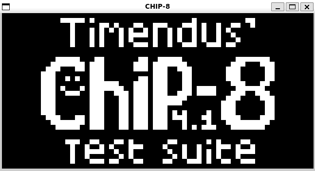
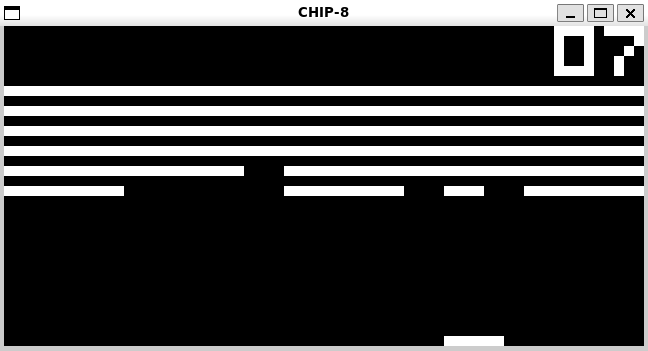
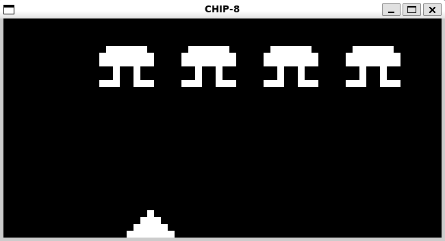

# CHIP-8 Emulator

Simple CHIP-8 emulator written in Rust. CHIP-8 is an interpreted programming language, developed by Joseph Weisbecker on his 1802 microprocessor. It was initially used on the COSMAC VIP and Telmac 1800, which were 8-bit microcomputers made in the mid-1970s.

(Technically, since CHIP-8 is an interpreted programming language, this is an interpreter and not an emulator)

<table>
  <tr>
    <td></td>
    <td></td>
    <td></td>
  </tr>
</table>

## CHIP-8 Components

CHIP-8 has the following components:

- **Memory**: CHIP-8 has direct access to up to 4 kilobytes of RAM.
- **Display**: 64 x 32 pixels (or 128 x 64 for SUPER-CHIP) monochrome, ie. black or white.
- **Program counter**, often called just “PC”, which points at the current instruction in memory.
- One 16-bit **index register** called “I” which is used to point at locations in memory.
- A **stack** for 16-bit addresses, which is used to call subroutines/functions and return from them.
- An 8-bit **delay timer** which is decremented at a rate of 60 Hz (60 times per second) until it reaches 0.
- An 8-bit **sound timer** which functions like the delay timer, but which also gives off a beeping sound as long as it’s not 0.
- 16 8-bit (one byte) general-purpose variable **registers** numbered 0 through F hexadecimal, ie. 0 through 15 in decimal, called V0 through VF.

## Usage

You're gonna need to have Rust and SDL2 installed

```rust
cargo run [path to rom]
```

### Keypad

The original Chip 8 had a hexadecimal keypad (0 - 9 and A - F). The key mapping are detailed in the following table

| Chip 8 Key | Keyboard Key |
| :--------: | :----------: |
|    `1`     |     `1`      |
|    `2`     |     `2`      |
|    `3`     |     `3`      |
|    `4`     |     `Q`      |
|    `5`     |     `W`      |
|    `6`     |     `E`      |
|    `7`     |     `A`      |
|    `8`     |     `S`      |
|    `9`     |     `D`      |
|    `0`     |     `X`      |
|    `A`     |     `Z`      |
|    `B`     |     `C`      |
|    `C`     |     `4`      |
|    `D`     |     `R`      |
|    `E`     |     `F`      |
|    `F`     |     `V`      |

## Resources

Here is a list of really helpful resources if you wanna attempt this project yourself:

- [High level CHIP-8 guide, by Tobias V. Langhoff](https://tobiasvl.github.io/blog/write-a-chip-8-emulator/#fx0a-get-key)
- [How to write an emulator (CHIP-8 interpreter)](https://multigesture.net/articles/how-to-write-an-emulator-chip-8-interpreter/)
- [Cowgod's Chip-8 Technical Reference](http://devernay.free.fr/hacks/chip8/C8TECH10.HTM)
